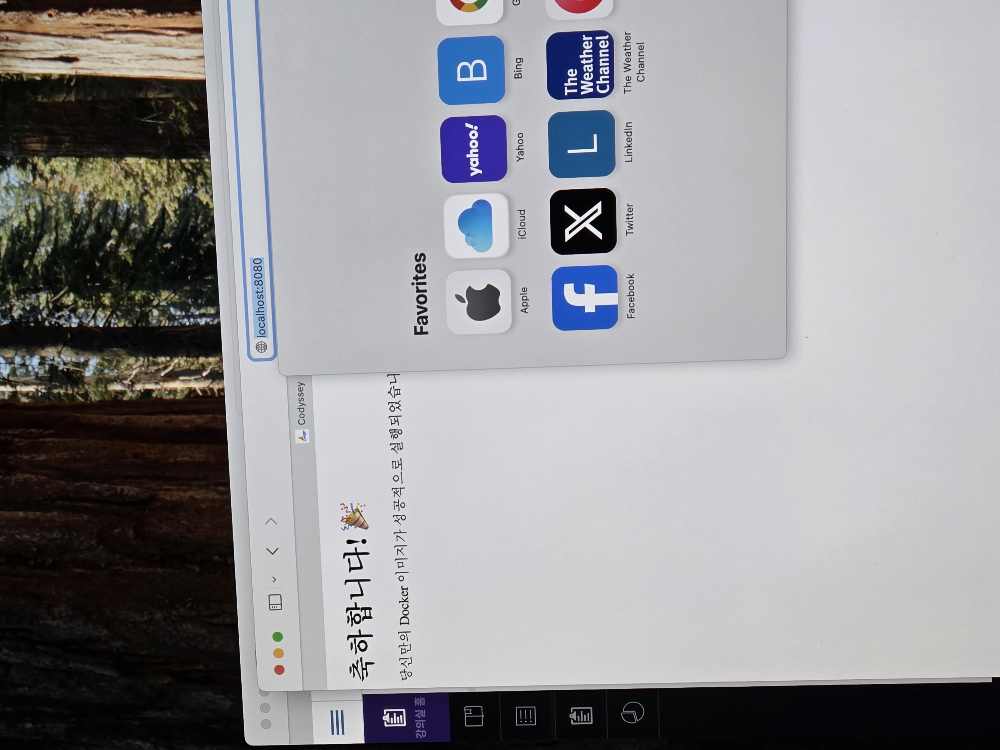

# AI Codyssey - 개발 워크스테이션 구축

## 1. 프로젝트 개요
터미널, Git, Docker를 활용하여 개발 워크스테이션 환경을 구축하는 과제이다.  
터미널 기본 조작, 파일 권한 관리, GitHub 연동, Docker 컨테이너 실행 및 검증 과정을 수행하며 재현 가능한 개발 환경 구성을 목표로 한다.

---

## 2. 실행 환경
- OS: macOS
- Shell: zsh
- Terminal: VSCode Terminal
- Git: 2.53.0
- Docker: (docker --version 결과 입력)

---

## 3. 수행 체크리스트

- [x] 터미널 기본 조작
- [x] 파일 권한 변경 실습
- [x] Git 설정
- [x] GitHub 저장소 생성 및 연동
- [x] README 작성 및 Push
- [ ] Docker 설치 및 점검
- [ ] hello-world 실행
- [ ] Dockerfile 빌드
- [ ] 포트 매핑 검증
- [ ] 볼륨 영속성 검증
- [ ] 트러블슈팅 2건 이상

---

## 4. 터미널 기본 조작

### 현재 위치 확인

```
$ pwd
(결과 입력)

'''
## 4. 터미널 기본 조작

### 1) 현재 위치 및 파일 확인

```bash
$ pwd
/Users/spman06195118

결과: pwd 명령어를 사용해 현재 위치를 확인하였다. 절대 경로를 보여준다.


$ ls -la
total 24
drwxr-x---+ 23 spman06195118  spman06195118   736 Apr  5 20:57 .
drwxr-xr-x   9 root           admin           288 Apr  5 19:32 ..
-r--------   1 spman06195118  spman06195118     7 Apr  5 19:32 .CFUserTextEncoding
drwxr-xr-x   5 spman06195118  spman06195118   160 Apr  5 19:34 .docker
drwxr-xr-x  11 spman06195118  spman06195118   352 Apr  5 20:51 .git
-rw-r--r--   1 spman06195118  spman06195118    38 Apr  5 20:57 .gitconfig
drwxr-xr-x  10 spman06195118  spman06195118   320 Apr  5 19:34 .orbstack
drwxr-xr-x   3 spman06195118  spman06195118    96 Apr  5 19:34 .ssh
drwx------+  2 spman06195118  spman06195118    64 Apr  5 19:33 .Trash
drwxr-xr-x   5 spman06195118  spman06195118   160 Apr  5 20:38 .vscode
-rw-------   1 spman06195118  spman06195118   201 Apr  5 20:50 .zsh_history
drwx------   3 spman06195118  spman06195118    96 Apr  5 20:38 .zsh_sessions
drwx------+  3 spman06195118  spman06195118    96 Apr  5 19:32 Desktop
drwx------+  3 spman06195118  spman06195118    96 Apr  5 19:32 Documents
drwx------+  4 spman06195118  spman06195118   128 Apr  5 20:36 Downloads
drwx------@ 79 spman06195118  spman06195118  2528 Apr  5 19:52 Library
drwx------   3 spman06195118  spman06195118    96 Apr  5 19:32 Movies
drwx------+  3 spman06195118  spman06195118    96 Apr  5 19:32 Music
drwx------   4 spman06195118  spman06195118   160 Apr  5 19:34 OrbStack
drwx------+  4 spman06195118  spman06195118   128 Apr  5 19:33 Pictures
-rw-r--r--   1 spman06195118  spman06195118     0 Apr  5 20:39 projects
drwxr-xr-x   5 spman06195118  spman06195118   160 Apr  5 21:18 projectss
drwxr-xr-x+  4 spman06195118  spman06195118   128 Apr  5 19:32 Public

결과: ls -la 명령어를 사용해 숨겨져 있는 파일을 포함해서 상세 정보를 확인하였다.


$ mkdir practice
$ cd practice

$ pwd
/Users/spman06195118/practice

결과: mkdir 명령어를 사용해 practice라는 디렉토리를 만들고 cd 명령어를 사용해 현재 위치를 practice로 이동하였다.
 pwd 명령어를 사용해 위치가 변경된 것을 확인하였다.


$ touch file1.txt
$ ls
file1.txt

결과: touch 명령어를 사용해 빈 파일을 생성하였다. ls 명령어를 사용해 파일이 생성된 것을 확인하였다.


$ cp file1.txt file2.txt
$ ls
file1.txt file2.txt

결과: cp 명령어를 사용해 기존 파일을 복사하여 새로운 파일을 생성항였다. ls 명령어를 사용해 파일이 복사된 것을 확인하였다.


$ mv file2.txt renamed.txt
$ ls
file1.txt renamed.txt

결과: mv 명령어를 사용해 파일의 이름을 변경하였다. ls 명령어를 사용해 파일이 변경된 것을 확인하였다.


$ rm file1.txt
$ ls
renamed.txt

결과: rm 명령어를 사용해 파일을 삭제하였다. ls 명령어를 사용해 파일이 삭제되었는지 확인하였다.


$ cat renamed.txt

결과: cat 명령어를 사용해 파일을 실행하였다. 파일이 비어있어 아무 것도 실행되지 않았다.


---

# 🔥 4. 권한 파트도 개선 (추가 추천)

```md
## 5. 파일 권한 변경

```bash
$ ls -l
-rw-r--r--  1 spman06195118  spman06195118  0 Apr  5 21:54 renamed.txt

결과: ls -l 명령어를 사용해 권한을 확인하였다.


$ chmod 755 renamed.txt

결과: chmod 명령어를 사용해 644였던 파일 권한을 755로 변경하였다.

의미: 755는 소유자에게 rwx 권한을 부여하고 그룹과 기타 사용자에게는 rx 권한을 부여한다. 
r = 4, w = 2, x = 1 을 뜻하고 이를 더한 값으로 나타낸다. 맨 앞자리는 소유자, 두번 째자리는 그룹, 마지막자리는 기타 사용자를 의미한다. 


$ ls -l
-rwxr-xr-x  1 spman06195118  spman06195118  0 Apr  5 21:54 renamed.txt

결과: ls -l 명령어를 사용해 권한이 변경되었는지 확인하였다.
'''

#깃허브 설정 증거
'''
spman06195118@c4r7s7 project % git config --list
credential.helper=osxkeychain
core.repositoryformatversion=0
core.filemode=true
core.bare=false
core.logallrefupdates=true
core.ignorecase=true
core.precomposeunicode=true
user.name=JH
user.email=your@email.com
'''

#깃허브 연동 증거
'''spman06195118@c4r7s7 ai-codyssey % git remote -v
origin  https://github.com/spmann0619-ops/ai-codyssey (fetch)
origin  https://github.com/spmann0619-ops/ai-codyssey (push)
'''
##docker 설치 및 기본 점검
'''
spman06195118@c3r7s7 ~ % docker --version 
Docker version 28.5.2, build ecc6942

spman06195118@c3r7s7 ~ % docker info
Client:
 Version:    28.5.2
 Context:    orbstack
 Debug Mode: false
 Plugins:
  buildx: Docker Buildx (Docker Inc.)
    Version:  v0.29.1
    Path:     /Users/spman06195118/.docker/cli-plugins/docker-buildx
  compose: Docker Compose (Docker Inc.)
    Version:  v2.40.3
    Path:     /Users/spman06195118/.docker/cli-plugins/docker-compose

Server:
 Containers: 0
  Running: 0
  Paused: 0
  Stopped: 0
 Images: 0
 Server Version: 28.5.2
 Storage Driver: overlay2
  Backing Filesystem: btrfs
  Supports d_type: true
  Using metacopy: false
  Native Overlay Diff: true
  userxattr: false
 Logging Driver: json-file
 Cgroup Driver: cgroupfs
 Cgroup Version: 2
 Plugins:
  Volume: local
  Network: bridge host ipvlan macvlan null overlay
  Log: awslogs fluentd gcplogs gelf journald json-file local splunk syslog
 CDI spec directories:
  /etc/cdi
  /var/run/cdi
 Swarm: inactive
 Runtimes: io.containerd.runc.v2 runc
 Default Runtime: runc
 Init Binary: docker-init
 containerd version: 1c4457e00facac03ce1d75f7b6777a7a851e5c41
 runc version: d842d7719497cc3b774fd71620278ac9e17710e0
 init version: de40ad0
 Security Options:
  seccomp
   Profile: builtin
  cgroupns
 Kernel Version: 6.17.8-orbstack-00308-g8f9c941121b1
 Operating System: OrbStack
 OSType: linux
 Architecture: x86_64
 CPUs: 6
 Total Memory: 15.67GiB
 Name: orbstack
 ID: 1fc083d9-b3df-4887-a40b-055dd8d300f3
 Docker Root Dir: /var/lib/docker
 Debug Mode: false
 Experimental: false
 Insecure Registries:
  ::1/128
  127.0.0.0/8
 Live Restore Enabled: false
 Product License: Community Engine
 Default Address Pools:
   Base: 192.168.97.0/24, Size: 24
   Base: 192.168.107.0/24, Size: 24
   Base: 192.168.117.0/24, Size: 24
   Base: 192.168.147.0/24, Size: 24
   Base: 192.168.148.0/24, Size: 24
   Base: 192.168.155.0/24, Size: 24
   Base: 192.168.156.0/24, Size: 24
   Base: 192.168.158.0/24, Size: 24
   Base: 192.168.163.0/24, Size: 24
   Base: 192.168.164.0/24, Size: 24
   Base: 192.168.165.0/24, Size: 24
   Base: 192.168.166.0/24, Size: 24
   Base: 192.168.167.0/24, Size: 24
   Base: 192.168.171.0/24, Size: 24
   Base: 192.168.172.0/24, Size: 24
   Base: 192.168.181.0/24, Size: 24
   Base: 192.168.183.0/24, Size: 24
   Base: 192.168.186.0/24, Size: 24
   Base: 192.168.207.0/24, Size: 24
   Base: 192.168.214.0/24, Size: 24
   Base: 192.168.215.0/24, Size: 24
   Base: 192.168.216.0/24, Size: 24
   Base: 192.168.223.0/24, Size: 24
   Base: 192.168.227.0/24, Size: 24
   Base: 192.168.228.0/24, Size: 24
   Base: 192.168.229.0/24, Size: 24
   Base: 192.168.237.0/24, Size: 24
   Base: 192.168.239.0/24, Size: 24
   Base: 192.168.242.0/24, Size: 24
   Base: 192.168.247.0/24, Size: 24
   Base: fd07:b51a:cc66:d000::/56, Size: 64
   '''
## 기본 운영/검증

spman06195118@c3r7s7 ai-codyssey % docker images
REPOSITORY   TAG       IMAGE ID   CREATED   SIZE

도커 이미지 목록


spman06195118@c3r7s7 ai-codyssey % docker run hello-world
Unable to find image 'hello-world:latest' locally
latest: Pulling from library/hello-world
4f55086f7dd0: Pull complete 
Digest: sha256:f9078146db2e05e794366b1bfe584a14ea6317f44027d10ef7dad65279026885
Status: Downloaded newer image for hello-world:latest

Hello from Docker!
This message shows that your installation appears to be working correctly.

To generate this message, Docker took the following steps:
 1. The Docker client contacted the Docker daemon.
 2. The Docker daemon pulled the "hello-world" image from the Docker Hub.
    (amd64)
 3. The Docker daemon created a new container from that image which runs the
    executable that produces the output you are currently reading.
 4. The Docker daemon streamed that output to the Docker client, which sent it
    to your terminal.

To try something more ambitious, you can run an Ubuntu container with:
 $ docker run -it ubuntu bash

Share images, automate workflows, and more with a free Docker ID:
 https://hub.docker.com/

For more examples and ideas, visit:
 https://docs.docker.com/get-started/

 hello-world 이미지를 다운로드하고, 컨테이너를 실행한 뒤, 성공 메시지를 출력하고 종료된 과정


spman06195118@c3r7s7 ai-codyssey % docker ps
CONTAINER ID   IMAGE     COMMAND   CREATED   STATUS    PORTS     NAMES

컨테이너 목록


spman06195118@c3r7s7 ai-codyssey % docker ps -a
CONTAINER ID   IMAGE         COMMAND    CREATED         STATUS                     PORTS     NAMES
42c9c1db3909   hello-world   "/hello"   4 minutes ago   Exited (0) 4 minutes ago             friendly_cray

실행 중이거나 종료된 모든 컨테이너 목록


spman06195118@c3r7s7 ai-codyssey % docker logs 42c9

Hello from Docker!
This message shows that your installation appears to be working correctly.

To generate this message, Docker took the following steps:
 1. The Docker client contacted the Docker daemon.
 2. The Docker daemon pulled the "hello-world" image from the Docker Hub.
    (amd64)
 3. The Docker daemon created a new container from that image which runs the
    executable that produces the output you are currently reading.
 4. The Docker daemon streamed that output to the Docker client, which sent it
    to your terminal.

To try something more ambitious, you can run an Ubuntu container with:
 $ docker run -it ubuntu bash

Share images, automate workflows, and more with a free Docker ID:
 https://hub.docker.com/

For more examples and ideas, visit:
 https://docs.docker.com/get-started/

 특정 컨테이너가 실행되면서 남긴 기록(로그)


docker stats  ->  CONTAINER ID   NAME      CPU %     MEM USAGE / LIMIT   MEM %     NET I/O   BLOCK I/O   PIDS 

현재 실행 중인 모든 컨테이너의 CPU, 메모리, 네트워크 사용량을 실시간으로 보여줌


##컨테이너 실행
'''
spman06195118@c3r7s7 ai-codyssey % docker run -it -d --name ubuntu-shell ubuntu bash

Unable to find image 'ubuntu:latest' locally
latest: Pulling from library/ubuntu
b40150c1c271: Pull complete 
Digest: sha256:c4a8d5503dfb2a3eb8ab5f807da5bc69a85730fb49b5cfca2330194ebcc41c7b
Status: Downloaded newer image for ubuntu:latest
a4d21219812aff3d7e5359c63f3269d28a88b0a02d44de57e4002dfabb4d23d5

컨테이너 생성


spman06195118@c3r7s7 ai-codyssey % docker ps
CONTAINER ID   IMAGE     COMMAND   CREATED          STATUS          PORTS     NAMES
a4d21219812a   ubuntu    "bash"    16 seconds ago   Up 15 seconds             ubuntu-shell

생성 확인


spman06195118@c3r7s7 ai-codyssey % docker exec -it ubuntu-shell bash

exec로 접속


root@a4d21219812a:/# ls
bin   dev  home  lib64  mnt  proc  run   srv  tmp  var
boot  etc  lib   media  opt  root  sbin  sys  usr
root@a4d21219812a:/# pwd
/
root@a4d21219812a:/# echo "hello"
hello

명령어 실행 

root@a4d21219812a:/# exit
exit

터미널로 돌아감


spman06195118@c3r7s7 ai-codyssey % docker ps
CONTAINER ID   IMAGE     COMMAND   CREATED         STATUS         PORTS     NAMES
a4d21219812a   ubuntu    "bash"    3 minutes ago   Up 3 minutes             ubuntu-shell

컨테이너 사라지지 않음


pman06195118@c3r7s7 ai-codyssey % docker attach ubuntu-shell

attach로 접속


root@a4d21219812a:/# exit
exit

종료


spman06195118@c3r7s7 ai-codyssey % docker ps
CONTAINER ID   IMAGE     COMMAND   CREATED   STATUS    PORTS     NAMES

컨테이너 종료되어 사라짐


spman06195118@c3r7s7 ai-codyssey % docker ps -a
CONTAINER ID   IMAGE         COMMAND    CREATED          STATUS                      PORTS     NAMES
a4d21219812a   ubuntu        "bash"     4 minutes ago    Exited (0) 17 seconds ago             ubuntu-shell
42c9c1db3909   hello-world   "/hello"   38 minutes ago   Exited (0) 38 minutes ago             friendly_cray

종료된 것 확인
'''

##Dockerfile

'''
spman06195118@c3r7s7 project % touch index.html

html 파일 생성


spman06195118@c3r7s7 project % cat > index.html
<!DOCTYPE html>
<html>
<head>
<title>Docker 테스트</title>
<meta charset="UTF-8">
</head>
<body>
<h1>축하합니다! 🎉</h1>
<p>당신만의 Docker 이미지가 성공적으로 실행되었습니다.</p>
</body>
</html>


spman06195118@c3r7s7 project % touch Dockerfile


spman06195118@c3r7s7 project % cat > Dockerfile

FROM nginx:alpine
COPY index.html /usr/share/nginx/html
EXPOSE 80


Nginx라는 가벼운 웹 서버 공식 이미지를 기반으로 시작

현재 디렉토리의 index.html 파일을 이미지 안의 특정 경로로 복사

/usr/share/nginx/html 는 Nginx가 웹 페이지를 보여주기 위해 사용하는 기본 폴더

이 컨테이너는 80번 포트를 사용


spman06195118@c3r7s7 project % docker build -t my-webserver:1.0 .
[+] Building 7.7s (7/7) FINISHED                          docker:orbstack
 => [internal] load build definition from Dockerfile                 0.2s
 => => transferring dockerfile: 574B                                 0.0s
 => [internal] load metadata for docker.io/library/nginx:alpine      2.7s
 => [internal] load .dockerignore                                    0.2s
 => => transferring context: 2B                                      0.0s
 => [internal] load build context                                    0.2s
 => => transferring context: 242B                                    0.0s
 => [1/2] FROM docker.io/library/nginx:alpine@sha256:5616878291a2ee  3.9s
 => => resolve docker.io/library/nginx:alpine@sha256:5616878291a2ee  0.2s
 => => sha256:812d47f806db497c53f9b47e76bdab38bcf 12.32kB / 12.32kB  0.0s
 => => sha256:6a0ac1617861a677b045b7ff88545213ec31c 3.86MB / 3.86MB  0.8s
 => => sha256:5616878291a2eed594aee8db4dade5878cf 10.33kB / 10.33kB  0.0s
 => => sha256:3bcf852aed06467cf075c6105892e4d5a6ebb 2.50kB / 2.50kB  0.0s
 => => sha256:583599bb7d382e9e986a9ff65204981307bfa7167 627B / 627B  0.5s
 => => sha256:82736a35d0e7f1309edc13d09115410b81542 1.87MB / 1.87MB  1.0s
 => => sha256:aee4e54b3865ee4d98545b6b49f9e8ab3b9b6ed11 956B / 956B  1.1s
 => => extracting sha256:6a0ac1617861a677b045b7ff88545213ec31c0ff08  0.1s
 => => sha256:781ff50d2644f74714c0d5a4ffa3447bbfd4b293c 404B / 404B  1.4s
 => => extracting sha256:82736a35d0e7f1309edc13d09115410b81542cf8b9  0.1s
 => => sha256:453da7dbc73e7338c4e201ec3f3c4a5f7751a 1.21kB / 1.21kB  1.6s
 => => sha256:4a8b0b2a5b1937755263ac7ac4ee26db2906c 1.40kB / 1.40kB  1.7s
 => => extracting sha256:583599bb7d382e9e986a9ff65204981307bfa71670  0.0s
 => => extracting sha256:aee4e54b3865ee4d98545b6b49f9e8ab3b9b6ed114  0.0s
 => => extracting sha256:781ff50d2644f74714c0d5a4ffa3447bbfd4b293cf  0.0s
 => => sha256:612c0c1df4c55a0bf145f84df03cb28de50 20.25MB / 20.25MB  2.2s
 => => extracting sha256:453da7dbc73e7338c4e201ec3f3c4a5f7751adbf5a  0.0s
 => => extracting sha256:4a8b0b2a5b1937755263ac7ac4ee26db2906c13a5d  0.0s
 => => extracting sha256:612c0c1df4c55a0bf145f84df03cb28de505e6a52f  0.4s
 => [2/2] COPY index.html /usr/share/nginx/html                      0.3s
 => exporting to image                                               0.2s
 => => exporting layers                                              0.1s
 => => writing image sha256:ca21ee455dc7495bb2dc6067efa308f2afb189a  0.0s
 => => naming to docker.io/library/my-webserver:1.0 


 spman06195118@c3r7s7 project % docker images
 REPOSITORY     TAG       IMAGE ID       CREATED              SIZE
my-webserver   1.0       ca21ee455dc7   About a minute ago   62.2MB
<none>         <none>    43a883dc0e26   19 hours ago         78.1MB
ubuntu         latest    0b1ebe5dd426   9 days ago           78.1MB
hello-world    latest    e2ac70e7319a   3 weeks ago          10.1kB


pman06195118@c3r7s7 project % docker run -d --name my-nginx-server -p 8080:80 my-webserver:1.0

내 컴퓨터의 8080번 포트를 컨테이너의 80번 포트에 연결하고 my-nginx-server를 이름으로 해서 my-webserver:1.0 이미지를 백그라운드에서 컨테이너를 실행 


spman06195118@c3r7s7 project % docker ps
CONTAINER ID   IMAGE              COMMAND                  CREATED              STATUS              PORTS                                     NAMES
7e5f4f703dd4   my-webserver:1.0   "/docker-entrypoint.…"   About a minute ago   Up About a minute   0.0.0.0:8080->80/tcp, [::]:8080->80/tcp   my-nginx-server

실행 확인


http://localhost:8080

웹브라우저 확인



##볼륨 영속성 증거

spman06195118@c3r7s7 project % docker volume create my-data
my-data

볼륨 생성


pman06195118@c3r7s7 project % docker run -d --name volume-test \
  -p 8082:80 \
  -v my-data:/usr/share/nginx/html \
  nginx
16e1d600be93034fa61409375b7a407524a19be1fe3315529a62222218ef258a

볼륨 연결 실행


spman06195118@c3r7s7 project % docker exec volume-test \
  sh -c 'echo "<h1>Volume Test: Data is Safe</h1>" > /usr/share/nginx/html/index.html'

  컨테이너 접속, index.html 파일 생성


  spman06195118@c3r7s7 project %  curl localhost:8082
<h1>Volume Test: Data is Safe</h1>

정상 실행 확인


spman06195118@c3r7s7 project % docker stop volume-test
docker rm volume-test
volume-test
volume-test

volume-test 컨테이너 삭제


pman06195118@c3r7s7 project % docker volume ls
DRIVER    VOLUME NAME
local     my-data

my-data 볼륨 남아있음


spman06195118@c3r7s7 project % docker run -d --name volume-test-2 \
  -p 8083:80 \
  -v my-data:/usr/share/nginx/html \
  nginx
2c003ff85da25fafc616ec31ce7299c40f80e3bc31b19b5e61dabd9fe58b0046

볼륨 연결 실행


spman06195118@c3r7s7 project % curl localhost:8083
<h1>Volume Test: Data is Safe</h1>

접속 확인


##바인드마운트

spman06195118@c3r7s7 bind-mount-practice % echo "<h1>Hello from my Computer!</h1>" > index.html

index.html 파일 생성


spman06195118@c3r7s7 bind-mount-practice % docker run -d --name bind-test \
  -p 8081:80 \
  -v "$(pwd)":/usr/share/nginx/html \
  nginx
bda3b738337deaaf4bc8bd6c10897f0192f047782c6c75a48d1ffefb0117dbd6

연결하고 실행


spman06195118@c3r7s7 bind-mount-practice % curl localhost:8081
<h1>Hello from my Computer!</h1>

연결 확인


spman06195118@c3r7s7 bind-mount-practice % echo '<h1>Wow, it changed in real-time!</h1>' > index.html

파일 수정


spman06195118@c3r7s7 bind-mount-practice % curl localhost:8081
<h1>Wow, it changed in real-time!</h1>

실시간 변경 확인


'''


## 트러블슈팅 1. Git Push가 되지 않은 문제

### 문제
README.md 파일을 수정한 뒤 git push를 실행했지만 GitHub 저장소에 변경 내용이 반영되지 않음

### 원인 가설
파일 내용을 수정했지만 저장하지 않아 Git이 변경 사항을 인식하지 못했을 가능성이 있다고 판단

### 확인

```bash
$ git status
nothing to commit, working tree clean

###해결
$ git add .
$ git commit -m "README 수정"
$ git push


##2. dockerfile 웹브라우저에서 한글로 출력이 안되는 문제

###문제: 한글이 깨져서 알아볼 수 없는 형태로 출력

###원인 가설: 한글로 번역이 되지 않고 인코딩이 진행

###확인: 축하합니다! 🎉

ë‹¹ì‹ ë§Œì˜ Docker 이미지가 ì„±ê³µì ìœ¼ë¡œ 실행되었습니다.  -> 이렇게 출력됨 

###해결: index.html 파일에 <meta charset="UTF-8"> 추가